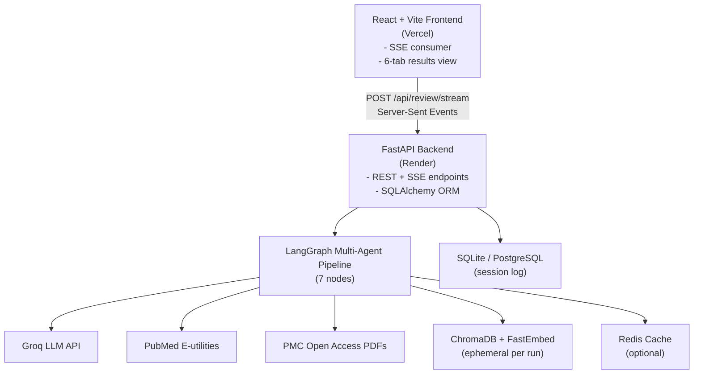

Agentic AI Medical Literature Research Assistant

An autonomous multi-agent AI system that plans literature searches, retrieves studies from PubMed and PubMed Central, screens them for relevance, extracts structured evidence, compares methodologies across studies, identifies research gaps, and generates a source-grounded literature review with inline [PMID: <id>] citations.

Built with LangGraph, FastAPI, React + TypeScript + Tailwind, ChromaDB, Redis, PubMed E-utilities, PyMuPDF, and Groq.

1. Project Overview

Medical researchers spend significant time manually searching PubMed, reading abstracts, extracting methodology details, and writing evidence syntheses. This project automates that workflow using a seven-agent pipeline orchestrated by LangGraph. A user submits a natural-language research question through a React frontend; the backend autonomously plans the search, retrieves papers, screens them, extracts structured evidence, compares studies, and produces a citation-grounded literature review — streamed live to the browser.

The system enforces a strict grounding guarantee: every factual claim in the final review must cite a real PMID that was actually retrieved. A dedicated reviewer agent verifies this programmatically and flags any hallucinated citations.

2. Problem Statement

Medical researchers must search large scholarly databases, identify relevant publications, extract methodological details, compare results, and prepare evidence-based literature summaries. The objective of this project is to develop an Agentic AI Medical Literature Research Assistant capable of automatically planning literature searches, retrieving relevant studies, extracting evidence, comparing research findings, and generating structured literature reviews.

Hard requirement: the system must not invent publications or references. Every important research claim must be traceable to a retrieved scholarly source.

3. Features

Query Planning
- LLM-generated PubMed search string
- Automatic sub-question decomposition

Retrieval
- NCBI PubMed E-utilities (E-search + E-fetch)
- Open-access PMC full-text PDF parsing

Caching
- Optional Redis cache for PMC PDF fetches (7-day TTL)

Screening
- LLM-based relevance filter
- Keyword-overlap rescue fallback if over-filtered

Extraction
- Dataset, sample size, validation protocol, model architecture, metrics, key findings

Comparison
- Dataset family grouping
- Method matrix
- Numeric metric summary
- Research gap detection

RAG
- ChromaDB ephemeral collection per run
- MMR retrieval over all screened docs

Grounding
- Inline [PMID: <id>] citations enforced
- Reviewer rejects hallucinated PMIDs

Persistence
- SQLAlchemy (SQLite for dev, PostgreSQL for prod) session log

Streaming
- Server-Sent Events — frontend receives one event per agent node

Frontend
- React + TypeScript + Tailwind
- Tabbed UI: Review / Papers / Matrix / Comparisons / Gaps / References
- Markdown export

Deployment
- Backend on Render
- Frontend on Vercel

4. System Architecture

Request flow:

1. Frontend POSTs { query, run_id } to /api/review/stream.
2. FastAPI runs the LangGraph pipeline in a worker thread.
3. Each completed node pushes a stage event into an asyncio queue.
4. The SSE generator yields data: {...} chunks back to the browser.
5. On completion, the final payload is emitted as type: "result".

5. Multi-Agent Workflow

The pipeline is a StateGraph with 7 nodes and linear edges:

planner → retriever → screener → extractor → comparator → synthesizer → reviewer → END

Node: planner
Agent: Query Planning Agent
Responsibility: Generates a PubMed search string and 3 sub-questions from the user's natural-language query

Node: retriever
Agent: Literature Retrieval Agent
Responsibility: Calls PubMed E-utilities; fetches open-access PDFs from PMC; parses full text with PyMuPDF

Node: screener
Agent: Screening Agent
Responsibility: LLM relevance filter (batched); falls back to keyword-overlap ranking if over-filtered

Node: extractor
Agent: Evidence Extraction Agent
Responsibility: Batched LLM call extracting Dataset, N, Validation, Model, Metrics, Findings per paper

Node: comparator
Agent: Comparison Agent
Responsibility: Groups by dataset family, builds method matrix, extracts numeric metrics, identifies research gaps

Node: synthesizer
Agent: Synthesis Agent
Responsibility: Builds a RAG context, writes a structured review with mandatory [PMID: ...] citations

Node: reviewer
Agent: Reviewer Agent
Responsibility: Programmatically verifies every cited PMID exists in the retrieved corpus; flags hallucinations

Each node returns a partial state dict that merges into the shared AgentState (a TypedDict).

6. Technologies Used

Backend
- Python 3.11
- FastAPI — REST + SSE endpoints
- LangGraph — state graph orchestration
- LangChain-Groq — LLM client
- Groq Cloud — openai/gpt-oss-20b model
- ChromaDB — vector store (ephemeral per run)
- FastEmbed — BAAI/bge-small-en-v1.5 embeddings
- PyMuPDF (fitz) — scientific PDF parsing
- BeautifulSoup4 — HTML scraping for PMC PDF links
- SQLAlchemy — ORM for session persistence
- Redis — optional PMC PDF cache
- Pydantic — request/response schemas
- Uvicorn — ASGI server

Frontend
- React 18
- TypeScript
- Tailwind CSS
- Vite
- react-markdown + remark-gfm — Markdown rendering
- lucide-react — icons

External
- NCBI PubMed E-utilities
- NCBI PMC ID Converter
- Groq API

Deployment
- Backend: Render (free tier)
- Frontend: Vercel (free tier)
- Database: SQLite (ephemeral on Render) — swap to Postgres for persistence

7. Scholarly Search Integration

The retrieval agent uses two NCBI services:

PubMed E-utilities
- esearch.fcgi with retmode=json returns up to 10 PMIDs sorted by relevance
- efetch.fcgi with retmode=xml returns full metadata: title, abstract, authors, journal, pub year

PMC ID Converter
- idconv/v1.0 maps a PMID to its PMC ID and open-access status
- Only open-access articles with a discoverable PDF link are downloaded

Full-text parsing
- PyMuPDF extracts the full text from the downloaded PDF
- A regex pass pulls Methods, Materials and Methods, Results, and Discussion sections
- Falls back to the first 6,000 characters if section detection fails
- All results are cached in Redis under pmc_pdf:<pmid> (7-day TTL) to avoid re-fetching

If a paper is not open access, the abstract from PubMed is used as the text payload.

8. RAG Implementation

The synthesis step uses Retrieval-Augmented Generation, implemented in synthesis_node:

Step 1 - Document construction
Each screened paper becomes a LangChain Document with page_content = "PMID <id> | <title>. <abstract>" and metadata { "pmid": <id> }.

Step 2 - Ephemeral vector store
A new chromadb.EphemeralClient() is instantiated per request, with a unique collection name derived from the run ID (run_<uuid>). This guarantees no state leaks between queries — critical for a multi-tenant deployment.

Step 3 - Embedding
Documents are embedded with FastEmbedEmbeddings using BAAI/bge-small-en-v1.5, a CPU-optimized sentence-transformer model chosen for its small footprint.

Step 4 - MMR retrieval
The retriever uses Maximum Marginal Relevance with k = len(docs) and fetch_k = len(docs), ensuring diverse coverage of all retrieved papers rather than redundant top-k results.

Step 5 - Prompt augmentation
The retrieved context is combined with a structured extraction table (dataset, N, validation, model, metrics, findings per paper) and pre-identified research gaps. This gives the LLM both unstructured text and structured signal.

Step 6 - Grounding enforcement
The system prompt enumerates the exact list of valid PMIDs and forbids citations outside it.

9. Evidence Extraction

The extractor agent uses a batched single LLM call (rather than one call per paper) to keep Groq's token usage low. Each paper is presented with an [index] marker; the LLM returns one block per paper:

[<index>]
Dataset: <name or "Not reported">
Sample Size: <N or "Not reported">
Validation: <protocol or "Not reported">
Model: <architecture or "Not reported">
Metrics: <numbers or "Not reported">
Findings: <one sentence>

The response is parsed with a markdown-tolerant regex that handles:
- [0], [ 0 ], 0), 0. index variations
- Bold (**Dataset:**), backticks, bullet prefixes
- Label case variations (DATASET, Dataset, dataset)

Any field the LLM cannot determine from the source text is set to "Not reported" — the model is explicitly forbidden from inventing values. Papers missing from the batched output are backfilled with default rows so no paper is silently dropped.

10. Study Comparison

The comparator node produces four artefacts:

Dataset comparison
Papers are grouped by the first token of their dataset field (e.g., CHB-MIT, Siena, Bonn). Each group lists sample sizes, validation protocols, and reported metrics for every paper using that dataset.

Method comparison
A flat table of {pmid, model, validation, key_findings} for every paper.

Metric summary
A regex extracts every percentage figure (\d+\.?\d*%) from the metrics field, producing a numeric_percentages array per paper. This makes it possible for the UI to highlight best-reported performance.

Research gaps
An LLM prompt over the extractions asks for exactly 3 distinct gaps, each grounded in an observed limitation across studies. Output is strictly formatted (3 lines, each starting with -) and falls back to a canned default if parsing fails.

11. Citation Tracking

Grounding is enforced at multiple layers:

In the synthesis prompt
- The system prompt lists the exact valid PMIDs from the current run
- Every factual sentence must end with [PMID: <id>]
- Model is explicitly told never to invent a PMID

Programmatic verification

PMID_PATTERN = re.compile(r"\[PMID:\s*(\d+)\]")

def _check_grounding(synthesis, real_pmids):
    cited = set(PMID_PATTERN.findall(synthesis))
    hallucinated = cited - real_pmids
    if hallucinated:
        return False, "hallucinated", hallucinated
    if not cited:
        return False, "no_citations", set()
    return True, "ok", cited

Automatic retry
- If hallucinated PMIDs are detected, the synthesis is regenerated once with a corrective prompt that explicitly lists the offending IDs and the allowed list
- If the retry also fails, the review is still returned but flagged

Reviewer verdict
- The final review_status field reports either "Approved — N unique PMIDs cited, all grounded" or "REJECTED — hallucinated PMIDs cited: [...]"
- The frontend surfaces this as a green or amber banner above the review

12. Reviewer Mechanism

The reviewer is a dedicated graph node separate from the synthesis step, so it can be reasoned about and tested independently.

Checks performed:

Condition: No references at all
Result: Approved — no references to verify

Condition: Cited PMID not in retrieved corpus
Result: REJECTED — hallucinated PMIDs cited: [...]

Condition: No [PMID: ...] anywhere in synthesis
Result: REJECTED — synthesis contains no PMID citations

Condition: All cited PMIDs match retrieved papers
Result: Approved — N unique PMIDs cited, all grounded

The verdict is returned in the API response as review_status and rendered in the frontend as a top-of-page banner. This satisfies the problem statement's hard requirement that the system must not invent references.

13. Installation

Prerequisites
- Python 3.11+
- Node.js 18+
- Git
- A Groq API key (free at console.groq.com)
- Optional: Redis (for caching)

Clone the repository
git clone https://github.com/Ashok-GH983/medical-ai-assistant.git
cd medical-ai-assistant

Backend setup
cd backend
python -m venv venv

Windows:
venv\Scripts\activate

macOS/Linux:
source venv/bin/activate

pip install -r requirements.txt

Frontend setup
cd ../frontend
npm install

14. Environment Variables

backend/.env
Copy backend/.env.example to backend/.env and fill in:

GROQ_API_KEY=your_groq_api_key_here
DATABASE_URL=sqlite:///./sessions.db
ALLOWED_ORIGINS=http://localhost:5173
REDIS_URL=redis://localhost:6379/0

Variable details:

GROQ_API_KEY — Required. API key from console.groq.com

DATABASE_URL — Required. SQLAlchemy connection string. Use sqlite:///./sessions.db for dev, postgresql://... for production

ALLOWED_ORIGINS — Required. Comma-separated list of allowed frontend origins (no trailing slashes)

REDIS_URL — Optional. If absent, caching is disabled gracefully

frontend/.env
Copy frontend/.env.example to frontend/.env:

VITE_API_URL=http://127.0.0.1:8000

In production, set this to the Render backend URL. No trailing slash.

15. How to Run

Local development

Terminal 1 — Backend:
cd backend
uvicorn main:app --host 0.0.0.0 --port 8000 --reload

Health check: http://127.0.0.1:8000

Terminal 2 — Frontend:
cd frontend
npm run dev

Open http://localhost:5173

Submit any research question (e.g., "deep learning EEG seizure detection"). The progress bar streams real agent events, then the review renders across all tabs.

Production
Both services are already deployed (see Section 16). To redeploy:
- Push to main → Render and Vercel auto-deploy
- Or trigger manual deploys from each dashboard

16. Deployed URL

Backend (Render): https://medical-ai-assistant-dl7u.onrender.com
Frontend (Vercel): https://medical-ai-assistant-rho.vercel.app
API Health Check: https://medical-ai-assistant-dl7u.onrender.com/

Note: Render free tier sleeps the backend after 15 minutes of inactivity. The first request after sleep may take 30-40 seconds. Subsequent requests are fast.

17. GitHub Repository

Repository: https://github.com/Ashok-GH983/medical-ai-assistant

Repository structure:

medical-ai-assistant/
├── backend/
│   ├── agent_pipeline.py      # LangGraph multi-agent pipeline
│   ├── main.py                # FastAPI app (REST + SSE)
│   ├── database.py            # SQLAlchemy models
│   ├── pubmed_tool.py         # Standalone PubMed helper
│   ├── check_models.py        # Utility script
│   ├── requirements.txt
│   └── .env.example
├── frontend/
│   ├── src/
│   │   ├── App.tsx            # Main UI + SSE consumer
│   │   ├── main.tsx
│   │   └── index.css
│   ├── public/
│   ├── index.html
│   ├── package.json
│   ├── tsconfig.json
│   ├── vite.config.ts
│   └── .env.example
├── .gitignore
└── README.md

18. Screenshots

Home screen
The landing page with the query input and "Execute Review" button. The header shows agent status and API connection indicator.

Live progress indicator
Six stage pills — Searching → Screening → Extracting → Comparing → Synthesizing → Completed — animated by real SSE events from the backend, not a timer.

Literature Review tab
The final synthesized review rendered as Markdown, with every factual sentence ending in [PMID: <id>] citations.

Evidence Matrix tab
A table with one row per paper and columns: PMID, Dataset, N, Validation, Model, Metrics, Key Findings.

Comparisons tab
Two panels side by side: Dataset Comparisons (grouped by dataset family) and Method Comparisons (per paper).

Research Gaps tab
Three identified gaps from the comparison agent, each grounded in an observed limitation across the retrieved studies.

References tab
A numbered list of every retrieved paper with authors, title, journal, year, and a clickable link to PubMed.

Reviewer verdict banner
A green "Approved" banner when all cited PMIDs match the retrieved corpus, or an amber "REJECTED" banner listing hallucinated IDs.

Add your own screenshots to a /docs/screenshots/ folder and reference them here.

19. Limitations

Free-tier rate limits
Groq's daily token cap (200,000 TPD on the openai/gpt-oss-20b free tier) allows approximately 6-10 full pipeline runs per day. Batching has reduced per-run token usage, but heavy testing still exhausts the quota.

Render cold starts
The backend sleeps after 15 minutes of inactivity. The first request after sleep takes 30-40 seconds.

Ephemeral SQLite
Render's filesystem is reset on each deploy, so session history is wiped. Production use requires switching to Render Postgres.

Open-access only
Full-text PDFs are only retrieved from PMC when the article is open access. Paywalled papers fall back to abstract-only extraction, which often leaves sample_size and validation as "Not reported".

Screening is LLM-dependent
Relevance screening relies on a batched LLM call. A keyword-overlap rescue prevents the corpus from being emptied, but individual irrelevant papers may slip through.

No true entailment check
The reviewer verifies that cited PMIDs exist, but it does not verify that the sentence's claim matches the source content. A misrepresented-but-correctly-cited claim would still pass.

PDF section detection is heuristic
The regex that finds Methods / Results sections may fail on unusual paper formats and silently fall back to a truncated full text.

Single-retry grounding
If both the initial synthesis and one retry contain hallucinated PMIDs, the second output is returned with a REJECTED verdict rather than regenerating further.

20. Future Improvements

- Persistent Postgres — switch DATABASE_URL to Render Postgres so session history survives redeploys.
- Entailment checking — add a Natural Language Inference pass (e.g., cross-encoder/nli-deberta-v3-small) to verify that each cited sentence is entailed by the source abstract, not just that the PMID exists.
- Agent memory across runs — cache successful pipelines and reuse them for closely related queries. A small "similar past runs" lookup would reduce token consumption dramatically.
- Async HTTP — replace requests with httpx.AsyncClient so PubMed fetches don't block the thread pool.
- Real-time token streaming — stream LLM tokens during synthesis (Groq supports stream=True) so the review types out live in the UI.
- Multi-source retrieval — add bioRxiv, medRxiv, and Semantic Scholar as alternative scholarly sources with a merge/dedup stage.
- Interactive evidence matrix — make the Evidence Matrix sortable, filterable, and exportable to CSV.
- Compare across runs — let users pin multiple queries and view a side-by-side comparison of their reviews.
- Hybrid search — combine BM25 (keyword) with vector search (semantic) in the RAG step for better recall on rare medical terminology.
- Full unit + integration tests — pytest suite covering the pipeline against mocked Groq and PubMed responses.

License

Academic project — see course submission terms.

Acknowledgements

- NCBI for open access to PubMed E-utilities and PubMed Central
- Groq for fast LLM inference
- LangChain and LangGraph teams for the agent framework
- Render and Vercel for free-tier hosting